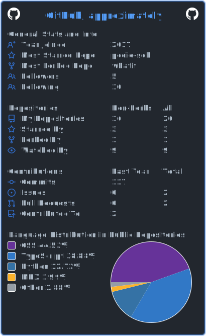

  

<h1 align="center">Hey, I'm Kevin 👋</h1>

  

  
  
  

I'm a product-minded software engineer in New York, currently building at **Sendblue**. I like turning fuzzy ideas into dependable products—especially where AI, developer tools, communication, and thoughtful interfaces overlap.

- 🔭 **Currently building:** [loo.ski](https://loo.ski), an agentic doppelganger of me!
- 🧠 **Ask me about:** AI, reverse engineering, energy, environment, & finance
- 🧭 **My bias:** ship the smallest useful thing
- 🐛 **Production bugs introduced:** classified

## Selected work

<table>
  <tr>
    <td width="50%" valign="top">
      <h3><a href="https://github.com/looskis/kueueski">⚡ kueueski</a></h3>
      
A fast command-line client for inspecting and operating BullMQ queues.

      
<code>Rust</code> <code>BullMQ</code> <code>CLI</code>

    </td>
    <td width="50%" valign="top">
      <h3><a href="https://github.com/looskis/blueski">💬 blueski</a></h3>
      
An AppleScript-powered macOS Messages daemon for sending and receiving iMessage.

      
<code>Rust</code> <code>AppleScript</code> <code>macOS</code>

    </td>
  </tr>
  <tr>
    <td width="50%" valign="top">
      <h3><a href="https://github.com/lookevink/srs-preprocessing">🔬 SRS preprocessing</a></h3>
      
A Python pipeline and REST API for processing scientific microscopy data.

      
<code>Python</code> <code>Imaging</code> <code>Data pipelines</code>

    </td>
    <td width="50%" valign="top">
      <h3><a href="https://github.com/lookevink/eso-portal-doc">📚 ESO Portal docs</a></h3>
      
Product documentation for a real-estate operations platform, built for clarity and fast answers.

      
<code>MDX</code> <code>Documentation</code> <code>Product</code>

    </td>
  </tr>
</table>

## Toolbox

  
  
  
  
  
  
  
  

## Latest public activity

<!-- BLOG-POST-LIST:START -->
- [lookevink deleted](https://github.com/looskis/homebrew-tap/compare/630b3a56d5...0000000000)
- [lookevink pushed homebrew-tap](https://github.com/looskis/homebrew-tap/compare/be8a0d4b96...b257e8135b)
- [lookevink contributed to looskis/homebrew-tap](https://github.com/looskis/homebrew-tap/pull/2)
- [lookevink contributed to looskis/homebrew-tap](https://github.com/looskis/homebrew-tap/pull/2)
- [lookevink created a branch](https://github.com/looskis/homebrew-tap/compare/0000000000...630b3a56d5)
<!-- BLOG-POST-LIST:END -->

## Beyond the code

I'm interested in filmmaking and storytelling, environmental and scientific data, product design, and finding the small bit of automation that removes a large amount of friction. When the laptop closes, the ski motif is not entirely decorative. ⛷️

  
<strong>📊 Numbers I don't take too seriously</strong>

   
  

    
  

  

<em>Build useful things. Keep a little weirdness.</em>

