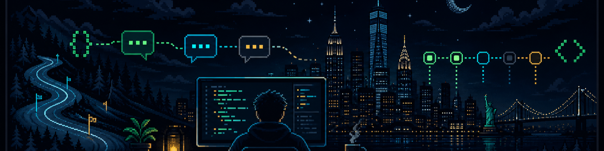

  

<h1 align="center">Hey, I'm Kevin 👋</h1>

  

  
  
  

I'm a product-minded software engineer in New York, currently building at **Sendblue**. I like turning fuzzy ideas into dependable products—especially where AI, developer tools, communication, and thoughtful interfaces overlap.

- 🔭 **Currently building:** [loo.ski](https://loo.ski), a terminal-flavored, multi-channel AI chat experience
- 🧠 **Ask me about:** AI products, TypeScript, Python, Next.js, APIs, automation, and chat systems
- 🧭 **My bias:** ship the smallest useful thing, learn from it, then make it excellent
- 🐛 **Production bugs introduced:** classified

## Selected work

<table>
  <tr>
    <td width="50%" valign="top">
      <h3><a href="https://github.com/lookevink/whatif">🎬 whatif</a></h3>
      
An AI-native local studio for filmmakers: versioned worlds, branching storylines, storyboards, and video-generation pipelines.

      
<code>Python</code> <code>FastAPI</code> <code>AI agents</code>

    </td>
    <td width="50%" valign="top">
      <h3><a href="https://github.com/lookevink/podio-sdk">🧰 podio-sdk</a></h3>
      
An opinionated TypeScript SDK built to make real-world Podio automation less painful.

      
<code>TypeScript</code> <code>SDK</code> <code>Automation</code>

    </td>
  </tr>
  <tr>
    <td width="50%" valign="top">
      <h3><a href="https://github.com/lookevink/srs-preprocessing">🔬 SRS preprocessing</a></h3>
      
A Python pipeline and REST API for processing scientific microscopy data.

      
<code>Python</code> <code>Imaging</code> <code>Data pipelines</code>

    </td>
    <td width="50%" valign="top">
      <h3><a href="https://github.com/lookevink/eso-portal-doc">📚 ESO Portal docs</a></h3>
      
Product documentation for a real-estate operations platform, built for clarity and fast answers.

      
<code>MDX</code> <code>Documentation</code> <code>Product</code>

    </td>
  </tr>
</table>

## Toolbox

  
  
  
  
  
  
  
  

## Latest public activity

<!-- BLOG-POST-LIST:START -->
- Building in public—watch this space.
<!-- BLOG-POST-LIST:END -->

## Beyond the code

I'm interested in filmmaking and storytelling, environmental and scientific data, product design, and finding the small bit of automation that removes a large amount of friction. When the laptop closes, the ski motif is not entirely decorative. ⛷️

  
<strong>📊 Numbers I don't take too seriously</strong>

   
  

    
    
  

  

    
  

  
<strong>🎧 Add my live soundtrack</strong>

   
  Spotify needs a one-time authorization before it can show a now-playing card. The ready-to-enable snippet is in <a href="./CUSTOMIZE.md"><code>CUSTOMIZE.md</code></a>.

  

<em>Build useful things. Keep a little weirdness.</em>

